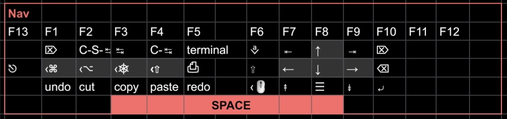

# Extend

My personal **Extend** (navigation/edition/function, also known as "Nav") layer rethink, inspired by existing solutions made by [DreymaR](https://forum.colemak.com/topic/2014-extend-extra-extreme/) and [Stevep99](https://github.com/stevep99/keyboard-tweaks/tree/master/ExtendLayer).
Refer to [Extend layers](https://colemakmods.github.io/ergonomic-mods/extend.html) to know more

Hold space key to activate

## My implementations

- [Extend](extend.kbd#L17-L23) layer, minimal starter pack, [Kanata](https://github.com/jtroo/kanata)
- My full config with [all other layers](36.kbd#L9-L95), including [Extend](36.kbd#L81-L87), [Kanata](https://github.com/jtroo/kanata) (use [this](36.kbd#L1-L5) key arrangement on ergo split keyboard)
- My full config with [Extend](https://github.com/XelorR/Keychron_qmk/blob/wireless_playground/keyboards/keychron/k11_max/jis_encoder/rgb/keymaps/my/keymap.c#L131-L136), [QMK](https://qmk.fm/)
